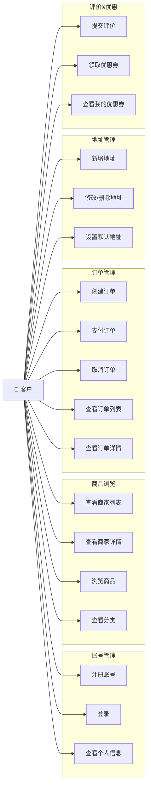
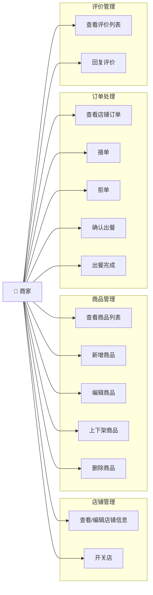
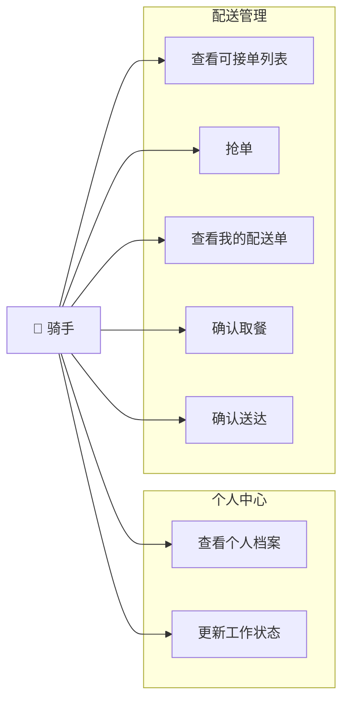
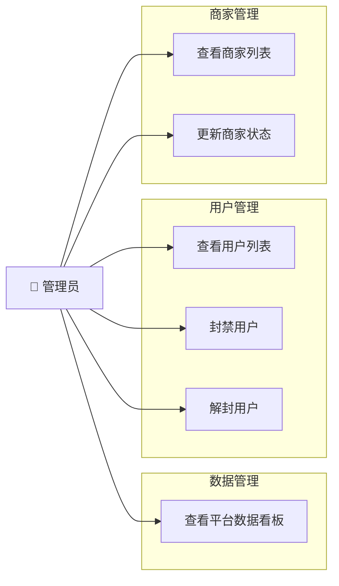
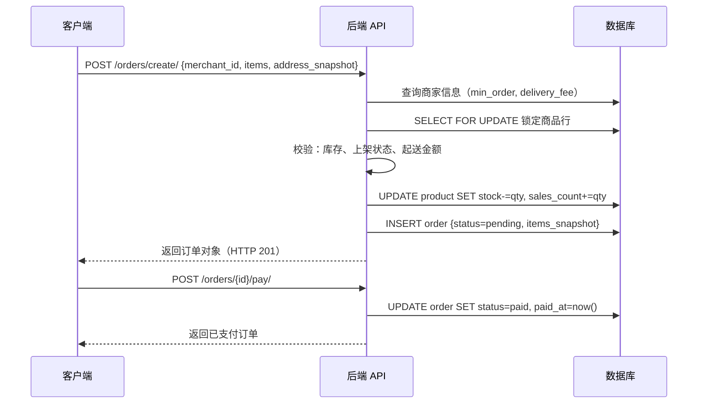
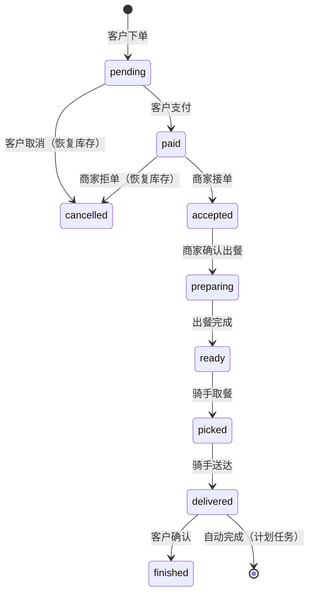

# ELM 外卖平台 — 设计说明书

**版本**: 1.0  
**日期**: 2026-07-08

---

## 一、用例图

### 1.1 客户用例



### 1.2 商家用例



### 1.3 骑手用例



### 1.4 管理员用例



---

## 二、功能结构图

```mermaid
graph TD
    Root["ELM 外卖平台"]

    Root --> FE["前端（4个角色端）"]
    Root --> BE["后端（Django REST API）"]
    Root --> DB["数据库（SQLite/PostgreSQL）"]

    FE --> C["Customer 客户端"]
    FE --> M["Merchant 商家端"]
    FE --> R["Rider 骑手端"]
    FE --> Mg["Manager 管理端"]

    C --> C1["账号：注册/登录/个人信息"]
    C --> C2["商家：列表/详情/商品浏览"]
    C --> C3["订单：下单/支付/取消/列表"]
    C --> C4["地址：增删改查/设默认"]
    C --> C5["评价：提交评价/查看评价"]
    C --> C6["优惠券：领取/查看"]

    M --> M1["店铺：编辑信息/开关店"]
    M --> M2["商品：增删改查/上下架"]
    M --> M3["订单：接单/拒单/出餐流转"]
    M --> M4["评价：查看/回复"]

    R --> R1["个人：查看档案/更新状态"]
    R --> R2["配送：可接单/抢单/取餐/送达"]

    Mg --> Mg1["看板：GMV/订单/商家/用户统计"]
    Mg --> Mg2["用户：列表/封禁/解封"]
    Mg --> Mg3["商家：列表/状态管理"]

    BE --> Auth["认证模块 accounts"]
    BE --> Orders["订单模块 orders"]
    BE --> Merchants["商家模块 merchants"]
    BE --> Products["商品模块 products"]
    BE --> Riders["骑手模块 riders"]
    BE --> Reviews["评价模块 reviews"]
    BE --> Addresses["地址模块 addresses"]
    BE --> Promotions["优惠券模块 promotions"]
    BE --> Admin["管理后台 admin_panel"]
    BE --> Uploads["上传模块 uploads"]
```



---

## 三、数据库 E-R 图

```mermaid
erDiagram
    User {
        bigint id PK
        varchar phone UK
        varchar password
        varchar email
        varchar avatar
        varchar status
        datetime date_joined
        datetime last_login
    }

    Role {
        int id PK
        varchar name UK
        varchar display_name
        json permissions
    }

    UserRole {
        bigint id PK
        bigint user_id FK
        int role_id FK
    }

    Merchant {
        bigint id PK
        bigint user_id UK_FK
        varchar store_name
        varchar logo
        varchar phone
        varchar address
        decimal min_order
        decimal delivery_fee
        varchar status
        decimal rating
        int monthly_sales
    }

    Category {
        int id PK
        varchar name UK
        varchar icon
        int sort_order
        bool is_active
    }

    Product {
        bigint id PK
        bigint merchant_id FK
        int category_id FK
        varchar name
        text description
        varchar image
        decimal price
        decimal original_price
        int stock
        varchar status
        int sales_count
        decimal rating
        json specs
        datetime created_at
        datetime updated_at
    }

    Address {
        bigint id PK
        bigint user_id FK
        varchar tag
        varchar contact_name
        varchar contact_phone
        varchar address
        bool is_default
        datetime created_at
    }

    Order {
        bigint id PK
        varchar order_no UK
        bigint customer_id FK
        bigint merchant_id FK
        bigint rider_id FK
        json address_snapshot
        json items_snapshot
        decimal total_amount
        decimal delivery_fee
        decimal paid_amount
        varchar status
        text note
        datetime created_at
        datetime paid_at
        datetime accepted_at
        datetime prepared_at
        datetime picked_at
        datetime delivered_at
    }

    Rider {
        bigint id PK
        bigint user_id UK_FK
        varchar real_name
        varchar phone
        varchar station
        varchar work_status
        decimal balance
        int total_orders
        decimal rating
        datetime created_at
    }

    Review {
        bigint id PK
        bigint order_id UK_FK
        bigint customer_id FK
        bigint merchant_id FK
        int rating
        text content
        json images
        text reply
        datetime replied_at
        datetime created_at
    }

    Upload {
        bigint id PK
        bigint user_id FK
        varchar file
        varchar content_type
        datetime created_at
    }

    Coupon {
        bigint id PK
        bigint merchant_id FK
        varchar name
        decimal discount_amount
        decimal min_spend
        datetime valid_until
        bool is_active
        datetime created_at
    }

    UserCoupon {
        bigint id PK
        bigint user_id FK
        bigint coupon_id FK
        varchar status
        datetime used_at
        datetime created_at
    }

    User ||--o{ UserRole : "拥有角色"
    Role ||--o{ UserRole : "分配给"
    User ||--o| Merchant : "开设店铺"
    User ||--o| Rider : "注册骑手"
    User ||--o{ Address : "拥有地址"
    User ||--o{ Order : "客户下单"
    User ||--o{ Upload : "上传文件"
    User ||--o{ UserCoupon : "持有优惠券"
    Merchant ||--o{ Product : "发布商品"
    Merchant ||--o{ Order : "接收订单"
    Merchant ||--o{ Review : "被评价"
    Merchant ||--o{ Coupon : "发放优惠券"
    Category ||--o{ Product : "分类"
    Rider ||--o{ Order : "配送订单"
    Order ||--o| Review : "被评价（一次）"
    Coupon ||--o{ UserCoupon : "被领取"
    Product }o--o{ Order : "订单快照(items_snapshot)"
```

---

## 四、数据库详细设计

> 以下为**实际实现**的表结构（基于 Django Models）。与概念设计文档的差异详见各表备注。

### 4.1 User（用户表）

表名: `user`，继承 Django AbstractUser

| 字段 | 类型 | 约束 | 说明 |
|------|------|------|------|
| id | BIGINT | PK | 用户ID（自增） |
| phone | VARCHAR(11) | UNIQUE NOT NULL | 手机号，作为登录凭证 |
| password | VARCHAR(128) | NOT NULL | bcrypt 哈希密码 |
| email | VARCHAR(254) | NULL | 邮箱（可选） |
| avatar | VARCHAR(200) | NULL | 头像 URL |
| status | VARCHAR(20) | DEFAULT 'active' | active / banned |
| is_active | BOOLEAN | DEFAULT TRUE | Django 内置，控制登录 |
| date_joined | DATETIME | auto | 注册时间（继承自 AbstractUser） |
| last_login | DATETIME | NULL | 最后登录时间 |

### 4.2 Role（角色表）

表名: `role`

| 字段 | 类型 | 约束 | 说明 |
|------|------|------|------|
| id | INT | PK | 角色ID（自增） |
| name | VARCHAR(50) | UNIQUE NOT NULL | customer / merchant / rider / admin |
| display_name | VARCHAR(50) | NOT NULL | 中文显示名 |
| permissions | JSON | DEFAULT [] | 权限码列表 |

**预置数据**：

| name | display_name | permissions |
|------|------|------|
| customer | 客户 | ["view_products", "create_order", ...] |
| merchant | 商家 | ["manage_store", "manage_products", ...] |
| rider | 骑手 | ["view_available_orders", "grab_order", ...] |
| admin | 管理员 | ["*"] |

### 4.3 UserRole（用户角色关联表）

表名: `user_role`

| 字段 | 类型 | 约束 | 说明 |
|------|------|------|------|
| id | BIGINT | PK | 自增 |
| user_id | BIGINT | FK(user.id) NOT NULL | 用户ID |
| role_id | INT | FK(role.id) NOT NULL | 角色ID |

唯一约束: `(user_id, role_id)`

### 4.4 Merchant（商家信息表）

表名: `merchant`

| 字段 | 类型 | 约束 | 说明 |
|------|------|------|------|
| id | BIGINT | PK | 商家ID |
| user_id | BIGINT | UNIQUE FK(user.id) | 关联用户（一对一） |
| store_name | VARCHAR(100) | NOT NULL | 店铺名称 |
| logo | VARCHAR(200) | NULL | 店铺 Logo URL |
| phone | VARCHAR(20) | NOT NULL | 联系电话 |
| address | VARCHAR(200) | NOT NULL | 详细地址 |
| min_order | DECIMAL(10,2) | DEFAULT 0 | 起送金额 |
| delivery_fee | DECIMAL(10,2) | DEFAULT 0 | 配送费 |
| status | VARCHAR(20) | DEFAULT 'open' | open / closed |
| rating | DECIMAL(3,2) | DEFAULT 5.0 | 综合评分（只读，系统维护） |
| monthly_sales | INT | DEFAULT 0 | 月销量（只读，系统维护） |

### 4.5 Category（商品分类表）

表名: `category`

| 字段 | 类型 | 约束 | 说明 |
|------|------|------|------|
| id | INT | PK | 分类ID |
| name | VARCHAR(50) | UNIQUE NOT NULL | 分类名称 |
| icon | VARCHAR(50) | NULL | 图标标识符 |
| sort_order | INT | DEFAULT 0 | 排序权重（升序） |
| is_active | BOOLEAN | DEFAULT TRUE | 是否启用 |

### 4.6 Product（商品表）

表名: `product`

| 字段 | 类型 | 约束 | 说明 |
|------|------|------|------|
| id | BIGINT | PK | 商品ID |
| merchant_id | BIGINT | FK(merchant.id) NOT NULL | 所属商家 |
| category_id | INT | FK(category.id) NULL | 所属分类（可为空） |
| name | VARCHAR(100) | NOT NULL | 商品名称 |
| description | TEXT | NULL | 商品描述 |
| image | VARCHAR(200) | NULL | 商品主图 URL |
| price | DECIMAL(10,2) | NOT NULL | 销售价格（≥ 0.01） |
| original_price | DECIMAL(10,2) | NULL | 原价（展示划线价） |
| stock | INT | DEFAULT 0 | 当前库存（≥ 0）；下单原子扣减 |
| status | VARCHAR(20) | DEFAULT 'off' | on（上架）/ off（下架） |
| sales_count | INT | DEFAULT 0 | 累计销量（只读） |
| rating | DECIMAL(3,2) | DEFAULT 5.0 | 评分（只读） |
| specs | JSON | NULL | 规格列表 `[{"name": "大份", "price_diff": 5}]` |
| created_at | DATETIME | auto | 创建时间 |
| updated_at | DATETIME | auto_update | 更新时间 |

### 4.7 Address（收货地址表）

表名: `address`

| 字段 | 类型 | 约束 | 说明 |
|------|------|------|------|
| id | BIGINT | PK | 地址ID |
| user_id | BIGINT | FK(user.id) NOT NULL | 所属用户 |
| tag | VARCHAR(20) | NULL | 标签（家 / 公司 / 学校） |
| contact_name | VARCHAR(50) | NOT NULL | 收件人姓名 |
| contact_phone | VARCHAR(20) | NOT NULL | 联系电话 |
| address | VARCHAR(200) | NOT NULL | 详细地址 |
| is_default | BOOLEAN | DEFAULT FALSE | 是否默认地址（每用户唯一） |
| created_at | DATETIME | auto | 创建时间 |

### 4.8 Order（订单表）

表名: `order`

| 字段 | 类型 | 约束 | 说明 |
|------|------|------|------|
| id | BIGINT | PK | 订单ID |
| order_no | VARCHAR(32) | UNIQUE NOT NULL | 订单编号，格式 `OD{时间戳}{随机4位}` |
| customer_id | BIGINT | FK(user.id) NOT NULL | 下单客户 |
| merchant_id | BIGINT | FK(merchant.id) NOT NULL | 所属商家 |
| rider_id | BIGINT | FK(rider.id) NULL | 配送骑手（抢单后赋值） |
| address_snapshot | JSON | NOT NULL | 收货地址快照（防后续修改影响历史） |
| items_snapshot | JSON | NOT NULL | 商品明细快照 `[{product_id, name, price, quantity}]` |
| total_amount | DECIMAL(10,2) | NOT NULL | 商品总金额（服务端计算） |
| delivery_fee | DECIMAL(10,2) | DEFAULT 0 | 配送费 |
| paid_amount | DECIMAL(10,2) | NOT NULL | 实付金额 = total_amount + delivery_fee |
| status | VARCHAR(20) | DEFAULT 'pending' | 见状态枚举 |
| note | TEXT | NULL | 订单备注 |
| created_at | DATETIME | auto | 下单时间 |
| paid_at | DATETIME | NULL | 支付时间 |
| accepted_at | DATETIME | NULL | 商家接单时间 |
| prepared_at | DATETIME | NULL | 出餐完成时间 |
| picked_at | DATETIME | NULL | 骑手取餐时间 |
| delivered_at | DATETIME | NULL | 送达时间 |

**订单状态枚举**：

| 状态值 | 说明 | 转移触发者 |
|--------|------|----------|
| pending | 待支付 | — |
| paid | 已支付 | 客户（/pay） |
| accepted | 商家已接单 | 商家（/accept） |
| preparing | 备餐中 | 商家（/prepare） |
| ready | 出餐完成，待取餐 | 商家（/ready） |
| picked | 配送中 | 骑手（/pickup） |
| delivered | 已送达 | 骑手（/deliver） |
| finished | 已完成 | — |
| cancelled | 已取消 | 客户（/cancel）或商家（/reject） |

### 4.9 Rider（骑手表）

表名: `rider`

| 字段 | 类型 | 约束 | 说明 |
|------|------|------|------|
| id | BIGINT | PK | 骑手ID |
| user_id | BIGINT | UNIQUE FK(user.id) | 关联用户（一对一） |
| real_name | VARCHAR(50) | NOT NULL | 真实姓名 |
| phone | VARCHAR(20) | NOT NULL | 联系电话 |
| station | VARCHAR(100) | NULL | 所属配送站点 |
| work_status | VARCHAR(20) | DEFAULT 'offline' | offline / idle / busy / delivering |
| balance | DECIMAL(10,2) | DEFAULT 0 | 账户余额 |
| total_orders | INT | DEFAULT 0 | 累计配送单量 |
| rating | DECIMAL(3,2) | DEFAULT 5.0 | 好评率 |
| created_at | DATETIME | auto | 注册时间 |

### 4.10 Review（评价表）

表名: `review`

| 字段 | 类型 | 约束 | 说明 |
|------|------|------|------|
| id | BIGINT | PK | 评价ID |
| order_id | BIGINT | UNIQUE FK(order.id) | 关联订单（每订单最多一次评价） |
| customer_id | BIGINT | FK(user.id) NOT NULL | 评价人（客户） |
| merchant_id | BIGINT | FK(merchant.id) NOT NULL | 被评价商家 |
| rating | INT | NOT NULL | 评分 1-5 |
| content | TEXT | NULL | 文字评价 |
| images | JSON | NULL | 图片 URL 列表 |
| reply | TEXT | NULL | 商家回复 |
| replied_at | DATETIME | NULL | 回复时间 |
| created_at | DATETIME | auto | 评价时间 |

### 4.11 Upload（上传文件表）

表名: `upload`

| 字段 | 类型 | 约束 | 说明 |
|------|------|------|------|
| id | BIGINT | PK | 记录ID |
| user_id | BIGINT | FK(user.id) NOT NULL | 上传用户 |
| file | VARCHAR(255) | NOT NULL | 文件路径（`media/uploads/年/月/`） |
| content_type | VARCHAR(100) | NULL | MIME 类型 |
| created_at | DATETIME | auto | 上传时间 |

允许的 content_type: `image/jpeg` / `image/png` / `image/webp` / `image/gif`；大小上限 5 MB。

### 4.12 Coupon（优惠券表）

表名: `coupon`

| 字段 | 类型 | 约束 | 说明 |
|------|------|------|------|
| id | BIGINT | PK | 优惠券ID |
| merchant_id | BIGINT | FK(merchant.id) NULL | 关联商家（NULL 为平台通用券） |
| name | VARCHAR(100) | NOT NULL | 优惠券名称 |
| discount_amount | DECIMAL(10,2) | NOT NULL | 优惠金额 |
| min_spend | DECIMAL(10,2) | DEFAULT 0 | 最低消费额 |
| valid_until | DATETIME | NOT NULL | 有效期截止 |
| is_active | BOOLEAN | DEFAULT TRUE | 是否启用 |
| created_at | DATETIME | auto | 创建时间 |

### 4.13 UserCoupon（用户持有优惠券表）

表名: `user_coupon`

| 字段 | 类型 | 约束 | 说明 |
|------|------|------|------|
| id | BIGINT | PK | 记录ID |
| user_id | BIGINT | FK(user.id) NOT NULL | 用户 |
| coupon_id | BIGINT | FK(coupon.id) NOT NULL | 优惠券 |
| status | VARCHAR(20) | DEFAULT 'unused' | unused / used / expired |
| used_at | DATETIME | NULL | 使用时间 |
| created_at | DATETIME | auto | 领取时间 |

---

## 五、核心业务流程

### 5.1 下单流程



### 5.2 订单履约流程



---

## 六、技术架构说明

### 6.1 后端分层

```
config/             ← Django 项目配置（settings, urls, asgi/wsgi）
├── settings.py     ← 开发配置
└── settings_prod.py← 生产配置（Postgres, Redis, 限流, HTTPS）

accounts/           ← 用户认证模块
merchants/          ← 商家/店铺模块
products/           ← 商品/分类模块
orders/             ← 订单全生命周期（客户/商家/骑手三端接口）
addresses/          ← 收货地址
promotions/         ← 优惠券
riders/             ← 骑手档案
reviews/            ← 评价
admin_panel/        ← 管理后台（IsAdmin 权限）
uploads/            ← 文件上传
```

### 6.2 前端目录结构

```
fronted/
├── shared/         ← 共享组件（Toast, Modal, Header）
├── Customer/       ← 客户端（React 19 + TS + Vite）
│   └── src/
│       ├── api/    ← axios 实例 + API 模块
│       ├── contexts/ AuthContext.tsx（JWT 状态管理）
│       └── components/（每 Tab/Route 一个文件）
├── Merchant/       ← 商家端（同上结构）
├── Rider/          ← 骑手端（同上结构）
└── Manager/        ← 管理端（同上结构）
```

所有前端使用相同的 axios 配置模式：
- `api/config.ts`: axios 实例，自动附加 Bearer Token，401 自动清除
- `api/index.ts`: 按业务领域分组的 API 方法
- `contexts/AuthContext.tsx`: JWT 登录/登出状态，含角色白名单校验
